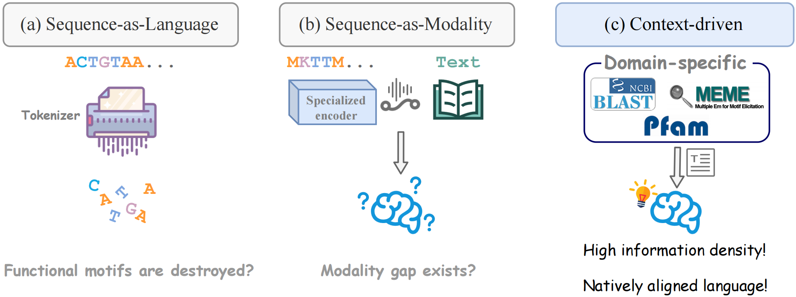

# Context as the Key Engine

This is an integrated pipeline for protein function analysis that combines multiple tools—BLAST, InterProScan, GO annotation, and LLM-based reasoning—to automate the end‑to‑end workflow from sequence to function prediction.



## Features

* **Multi‑tool integration:** Integrates BLAST, InterProScan, Foldseek, ProTrek, and other bioinformatics tools.
* **Parallel processing:** Supports large‑scale parallel execution with configurable process counts for prompt generation and LLM inference.
* **Flexible modes:** Supports both enzyme function prediction and general function prediction.
* **Intermediate artifacts:** Automatically saves BLAST, InterProScan, and other intermediate results for reuse.
* **QA dataset generation:** Supports LMDB‑based question–answer dataset construction.

## Directory Structure

```
Lost_in_tokenization/
├── examples/                    # Examples
│   ├── input.fasta             # Example input FASTA file
│   ├── pids.txt                # Example protein ID list
│   └── *.pdb                   # Example PDB structure files
├── tools/                       # Tool modules
│   ├── blast.py                # BLAST helper
│   ├── interproscan.py         # InterProScan helper
│   └── go_integration_pipeline.py  # GO integration pipeline
│   └── foldseek.py              # Foldseek helper
├── utils/                       # Utilities
│   ├── utils.py                # Common helpers
│   ├── prompts.py              # LLM prompt templates
│   ├── openai_access.py        # OpenAI API access
│   ├── get_protrek_text.py     # Fetch ProTrek text
│   ├── generate_protein_prompt.py  # Protein prompt generation
│   ├── protein_go_analysis.py  # GO analysis
│   └── mpr.py                  # Multiprocess runner
├── scripts/                     # Scripts
│   └── run_protrek_text.sh     # ProTrek batch script
├── data/                        # Data directory
│   └── raw_data/               # Raw data
│       ├── all_pfam_descriptions.json  # Pfam descriptions
│       ├── go.json             # GO information
│       └── interpro_data.json  # InterPro information
├── integrated_pipeline.py       # Main pipeline
├── setup.sh                     # Environment setup
└── README.md                    # This file
```

## Installation

### 1. Environment Setup

Run the setup script to configure the environment:

```bash
bash setup.sh
```

This script will:

* Install Python dependencies
* Configure BLAST databases
* Install InterProScan

### 2. Dependencies

Ensure the following tools are properly installed:

* **BLAST+**: For sequence similarity search
* **InterProScan**: For protein domain and functional site prediction
* **Foldseek**: For structure-based protein similarity search (optional, enabled by default)
* **Python 3.8+**: Python 3.8 or later is recommended

### 3. Data Preparation

Place the following files under `data/raw_data/`:

* `all_pfam_descriptions.json`: Pfam domain descriptions
* `go.json`: GO term definitions
* `interpro_data.json`: InterPro database metadata

## Usage

### Basic Usage

#### 1. Protein function prediction (non‑enzyme)

The simplest invocation with default parameters:

```bash
python integrated_pipeline.py \
    --output_dir output/my_analysis
```

This uses `examples/input.fasta` as the input and runs the full analysis pipeline.

#### 2. Enzyme function prediction

For enzyme analysis, add `--is_enzyme` to use the enzyme-specific prompt template:

```bash
python integrated_pipeline.py \
    --input_fasta examples/input.fasta \
    --output_dir output/enzyme_analysis \
    --is_enzyme
```

Note: `--is_enzyme` selects the `ENZYME_PROMPT` template, which includes self-correction mechanisms and conflict resolution specific to enzyme analysis. The actual output format depends on the question asked in the prompt.

#### 3. Use a custom FASTA file

```bash
python integrated_pipeline.py \
    --input_fasta path/to/your/proteins.fasta \
    --output_dir output/custom_analysis
```

### Advanced Usage

#### 1. Custom parallelism

```bash
python integrated_pipeline.py \
    --input_fasta examples/input.fasta \
    --output_dir output/parallel_analysis \
    --n_process_prompt 128 \
    --n_process_llm 32 \
    --blast_num_threads 128
```

Parameter notes:

* `--n_process_prompt`: Number of processes for prompt generation (default: 256)
* `--n_process_llm`: Number of processes for LLM answers (default: 64)
* `--blast_num_threads`: Threads used by BLAST (default: 256)

#### 2. Include ProTrek information

If ProTrek is required for function prediction:

```bash
python integrated_pipeline.py \
    --input_fasta examples/input.fasta \
    --output_dir output/protrek_analysis \
    --protrek_dir output/protrek_results \
    --selected_info_types motif go protrek
```

The pipeline will automatically check whether ProTrek results are complete. If missing, it will run the ProTrek script.

**Note:** ProTrek may take a long time (especially on unstable networks). If you already ran the ProTrek script manually, skip the automatic check with `--skip_protrek_check`:

```bash
python integrated_pipeline.py \
    --input_fasta examples/input.fasta \
    --output_dir output/protrek_analysis \
    --protrek_dir output/protrek_results \
    --selected_info_types motif go protrek \
    --skip_protrek_check
```

#### 3. Use Foldseek for structure-based search

Foldseek is enabled by default and combines with BLAST results for better GO annotation. To use Foldseek, you need PDB files:

```bash
python integrated_pipeline.py \
    --input_fasta examples/input.fasta \
    --output_dir output/foldseek_analysis \
    --pdb_dir path/to/pdb_files \
    --foldseek_database foldseek_db/sp \
    --foldseek_num_threads 64
```

Note: Foldseek is enabled by default. If you want to disable it, you'll need to modify the code or ensure `--use_foldseek` is not set (depending on your argument parser configuration).

#### 4. Skip BLAST, InterProScan, and Foldseek (reuse existing results)

If these tools have already been run, reuse prior outputs:

```bash
python integrated_pipeline.py \
    --input_fasta examples/input.fasta \
    --output_dir output/reuse_analysis \
    --interproscan_info_path output/previous/tool_results/interproscan_info.json \
    --blast_info_path output/previous/tool_results/blast_info.json \
    --foldseek_info_path output/previous/tool_results/foldseek_info.json
```

#### 5. Customize information types

Choose which information sources to include:

```bash
python integrated_pipeline.py \
    --input_fasta examples/input.fasta \
    --output_dir output/custom_info \
    --selected_info_types motif go protrek
```

Available information types:

* `motif`: Pfam domains
* `go`: GO annotations
* `protrek`: ProTrek predictions
* `domain`: InterPro domains
* `family`: Protein family

### Outputs

After the pipeline finishes, the output directory looks like this:

```
output_dir/
├── tool_results/                # Intermediate tool outputs
│   ├── interproscan_info.json  # InterProScan results
│   ├── blast_info.json         # BLAST results
│   └── foldseek_info.json      # Foldseek results (if enabled)
└── llm_answers/                 # LLM‑generated answers
    ├── protein_id_1.json       # Result for protein 1
    ├── protein_id_2.json       # Result for protein 2
    └── ...
```

LLM answer format (non‑QA mode):

```json
{
  "protein_id": "P40571",
  "prompt": "Full input prompt...",
  "llm_answer": "LLM‑generated functional analysis..."
}
```

LLM answer format (QA mode):

```json
{
  "protein_id": "P40571",
  "index": 0,
  "question": "Customized question",
  "ground_truth": "Reference answer...",
  "llm_answer": "LLM‑generated answer...",
  "question_type": "function"
}
```

## Full Argument List

```bash
python integrated_pipeline.py --help
```

### Required

* `--output_dir`: Path to the output directory

### Optional

**I/O:**

* `--input_fasta`: Input FASTA file (default: `examples/input.fasta`)
* `--temp_dir`: Temporary directory (default: `temp`)

**Skipping steps:**

* `--interproscan_info_path`: InterProScan results file (if set, skip InterProScan)
* `--blast_info_path`: BLAST results file (if set, skip BLAST)
* `--foldseek_info_path`: Foldseek results file (if set, skip Foldseek)

**Parallelism:**

* `--n_process_prompt`: Processes for prompt generation (default: 256)
* `--n_process_llm`: Processes for LLM answers (default: 64)

**BLAST parameters:**

* `--blast_database`: BLAST database name (default: `uniprot_swissprot`)
* `--expect_value`: E‑value threshold (default: `0.01`)
* `--blast_num_threads`: Number of BLAST threads (default: 256)

**InterProScan:**

* `--interproscan_path`: Path to InterProScan executable

**Foldseek parameters:**

* `--use_foldseek`: Whether to use Foldseek for structure-based search (default: `True`)
* `--foldseek_database`: Path to Foldseek database (default: `foldseek_db/sp`)
* `--foldseek_num_threads`: Number of threads for Foldseek (default: `64`)
* `--pdb_dir`: Directory containing PDB files for Foldseek analysis

**GO integration:**

* `--go_topk`: `topk` for GO integration (default: 1)

**Prompt generation:**

* `--selected_info_types`: List of information types (default: `motif go`)
* `--pfam_descriptions_path`: Path to Pfam description file
* `--go_info_path`: Path to GO info file
* `--interpro_data_path`: Path to InterPro metadata file
* `--lmdb_path`: Path to LMDB database (for QA dataset generation)
* `--protrek_dir`: Directory of ProTrek results
* `--is_enzyme`: Whether the sequence is an enzyme (selects `ENZYME_PROMPT` vs `FUNCTION_PROMPT`)
* `--skip_protrek_check`: Skip ProTrek check and use existing results directly

## Building a QA Dataset

You can create a QA dataset from UniProt entry descriptions using `generate_protein_qa.py`.

### 1. Download UniProt entries

First, download UniProt entry records for your proteins:

```bash
python download_uniprot_entry.py \
    --pids_path examples/pids.txt \
    --output_dir data/uniprot_entries
```

This downloads UniProt entries for all proteins listed in `pids.txt`.

### 2. Generate QA pairs

Then generate QA pairs from the downloaded entries:

```bash
python scripts/generate_protein_qa.py \
    --entry_dir data/uniprot_entries \
    --protein_id_files examples/pids.txt \
    --lmdb_path data/protein_qa.lmdb \
    --json_path data/protein_qa.json
```

**QA Pair Contents:**

The script generates three types of question-answer pairs for each protein (if the information is available in UniProt entries):

* **Function QA pair**: Question: "What is the function of this protein?" Answer: Protein function description from UniProt
* **Pathway QA pair**: Question: "What is the pathway of this protein?" Answer: Pathway information from UniProt
* **Subcellular location QA pair**: Question: "What is the subcellular location of this protein?" Answer: Subcellular location information from UniProt

Each QA pair includes:
- `protein_id`: The UniProt protein ID
- `question`: The question text
- `answer`: The ground truth answer (saved as `ground_truth` in LMDB format)
- `question_type`: One of `function`, `pathway`, or `subcellular_location`

The generated LMDB database can be directly used by `integrated_pipeline.py`.

### 3. Run the pipeline with the QA dataset

After generating the QA dataset, use it in the pipeline:

```bash
python integrated_pipeline.py \
    --input_fasta examples/input.fasta \
    --output_dir output/qa_analysis \
    --lmdb_path data/protein_qa.lmdb
```

This will create multiple QA pairs per protein and have the LLM answer all questions.

**Note:** If no `--lmdb_path` is provided, the pipeline will use the default question: "what is the function of this protein?"

## ProTrek Tool

ProTrek is a tri‑modal (sequence–structure–function) protein language model that can predict protein function.

### Run ProTrek separately

```bash
bash scripts/run_protrek_text.sh \
    examples/input.fasta \
    output/protrek_results \
    3 \
    1000
```

Arguments:

* 1st: Input FASTA file
* 2nd: Output directory
* 3rd: `topk` (number of results to return, default 3)
* 4th: Max retry count (default 1000)

The script automatically detects proteins missing ProTrek results and only processes the missing ones. It will retry on network errors.

## FAQ

### Q1: BLAST is slow—what can I do?

A: Increase the number of BLAST threads:

```bash
python integrated_pipeline.py --blast_num_threads 512 ...
```

### Q2: How can I save compute?

A: Reuse prior BLAST/InterProScan/Foldseek results when available:

```bash
python integrated_pipeline.py \
    --interproscan_info_path output/previous/tool_results/interproscan_info.json \
    --blast_info_path output/previous/tool_results/blast_info.json \
    --foldseek_info_path output/previous/tool_results/foldseek_info.json \
    ...
```

### Q3: ProTrek connection failures?

A: ProTrek uses an online API and may fail if the network is unstable. The script retries automatically up to 1000 times (configurable).

### Q4: How do I distinguish enzymes vs non‑enzymes?

A: Use `--is_enzyme`:

* Enzyme: add `--is_enzyme` (uses `ENZYME_PROMPT`, which includes self-correction mechanisms and conflict resolution specific to enzyme analysis)
* Non‑enzyme: omit the flag (uses `FUNCTION_PROMPT`, outputs general function descriptions)

The `--is_enzyme` flag determines which prompt template is used, not necessarily the output format. The actual output depends on the question asked in the prompt.

### Q5: How should I set the parallelism?

A: Tune based on your hardware and rate limits:

* `--n_process_prompt`: Can be high (e.g., 256) since it is mostly I/O‑bound
* `--n_process_llm`: Prefer moderate values (e.g., 32–64) due to API rate limits
* `--blast_num_threads`: Set according to CPU core count
* `--foldseek_num_threads`: Set according to CPU core count (default: 64)

### Q6: How does Foldseek work with BLAST?

A: Foldseek performs structure-based similarity search using PDB files, while BLAST performs sequence-based search. The pipeline combines results from both tools to improve GO annotation accuracy. Foldseek is particularly useful for detecting remote homologs where sequence similarity is low but structural similarity is high.

## Citation

If you use this pipeline, please cite:

**Zhuang, K., Zhang, J., Liu, Y., Cao, H., Gu, C., Liu, M., Gao, Z., Wang, Z. J., Zhou, X., Heng, P. A., Wu, L., He, C., & Tan, C.** (2025). Lost in Tokenization: Context as the Key to Unlocking Biomolecular Understanding in Scientific LLMs. *arXiv preprint arXiv:2510.23127*. 

```bibtex
@article{zhuang2025lost,
  title={Lost in Tokenization: Context as the Key to Unlocking Biomolecular Understanding in Scientific LLMs},
  author={Zhuang, Kai and Zhang, Jiawei and Liu, Yumou and Cao, Hanqun and Gu, Chunbin and Liu, Mengdi and Gao, Zhangyang and Wang, Zitong Jerry and Zhou, Xuanhe and Heng, Pheng-Ann and Wu, Lijun and He, Conghui and Tan, Cheng},
  journal={arXiv preprint arXiv:2510.23127},
  year={2025}
}
```

Paper: [https://arxiv.org/abs/2510.23127](https://arxiv.org/abs/2510.23127)

## License

(To be added.)

## Contact

For questions or suggestions, please contact: [zhuangkai@westlake.edu.cn](mailto:zhuangkai@westlake.edu.cn)

## Changelog

### v1.1.0 (2025‑10‑30)

* Added Foldseek integration for structure-based protein similarity search
* Foldseek results are combined with BLAST results for improved GO annotation
* Support for PDB file input for Foldseek analysis

### v1.0.0 (2025‑10‑19)

* Initial release
* Support for BLAST, InterProScan, and GO integration
* Support for ProTrek function prediction
* Support for parallel processing
* Support for QA dataset generation
